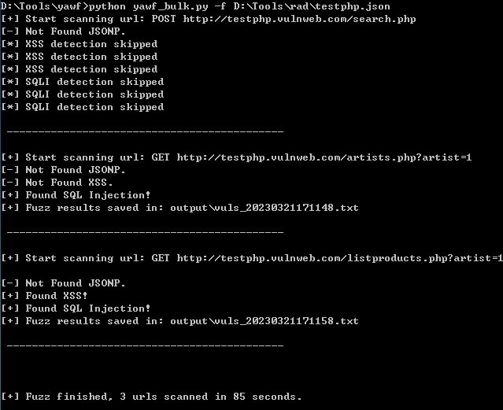

## Yawf - Yet Another Web Fuzzer

**Yawf** 是一个开源的 Web 漏洞自动化检测工具，能够帮助发现一些常见 Web 漏洞，包括：XSS、SQL injection、XXE、SSRF、Directory traversal、Log4Shell 和 JSONP 敏感信息泄露等。

⭐ 入选 KCon 2024 [兵器谱](https://kcon.knownsec.com/index.php?s=bqp&c=category&id=3)

### 特性

1.  支持检测动态 URL 和 HTTP Request 文件目标对象；
2.  支持手动和自动标记测试点，标记范围覆盖查询字符串、Cookie 和 POST Body；
3.  支持 GET 和 POST 请求，以及 form、json 和 xml 数据类型；
4.  支持 HTTP Basic/Digest/NTLM 认证；
5.  支持对测试目标进行并行（多进程）检测；
6.  容易扩展，探针和 Payload 文件分离；
7.  支持信息收集功能；
8.  支持设置 HTTP 网络代理；
9.  支持 ceye 和 dnslog 两种带外服务；
10. 高度可配置化，简单配置实现定制需求；
11. 支持批量检测。

### 漏洞探针

1.  **xss** - 跨站脚本探针
2.  **sqli** - SQL 注入探针
3.  **dt** - 目录遍历探针
4.  **fastjson** - Fastjson 探针（探测目标是否使用 Fastjson 组件）
5.  **log4shell** - Log4Shell 探针
6.  **xxe** - XXE 探针
7.  **ssrf** - SSRF 探针
8.  **jsonp** - JSONP 探针（内置，无需配置）

### 安装

需使用 Python 3.6+ 运行。首先，下载项目代码，然后安装依赖包。

```console
$ git clone https://github.com/phplaber/yawf.git
$ cd yawf
$ pip3 install -r requirements.txt
```

在正式使用前，建议先执行信息收集脚本，获取目标信息，如：是否 Web 站点、是否部署 Waf、Web Server、框架/脚本语言、端口信息、SSL 证书信息和 DNS 记录等，以制定扫描策略。

```console
$ python3 getinfo.py -h

Usage: getinfo.py [options]

+ Get infomation of target +

Options:
  -h, --help            show this help message and exit
  -u URL, --url=URL     Target URL(e.g. "http://www.target.com")
  -t TIMEOUT, --timeout=TIMEOUT
                        Port scan timeout (s)
```

由于 Yawf 在检测 XSS 漏洞时，使用了 headless Chrome，所以需预先安装 Chrome 环境。
首先，安装驱动程序 [ChromeDriver](https://sites.google.com/chromium.org/driver/)，并将可执行文件放置在 PATH 目录下；其次，安装 Chrome 可执行程序。在 Windows 和 Mac 平台上运行，如果已安装 Chrome 应用，则无需安装；在 Linux 平台上运行，需安装 google-chrome 可执行程序，并将其放置在 PATH 目录下。
如果执行 Yawf 时，报浏览器相关错误，请重点检查 ChromeDriver 和 Chrome 是否正确放置在 PATH 目录下。此外，也需关注 ChromeDriver 和 Chrome 的版本是否匹配。

```console
$ cp yawf.conf.sample yawf.conf
$ python3 yawf.py -h

_____.___.  _____  __      _____________
\__  |   | /  _  \/  \    /  \_   _____/
 /   |   |/  /_\  \   \/\/   /|    __)  
 \____   /    |    \        / |     \   
 / ______\____|__  /\__/\  /  \___  /   
 \/              \/      \/       \/    

Automated Web Vulnerability Fuzzer      
v2.7                               
Created by yns0ng (@phplaber)           

Usage: yawf.py [options]

Options:
  -h, --help            show this help message and exit
  -u URL, --url=URL     Target URL (e.g.
                        "http://www.target.com/page.php?id=1")
  -m METHOD             HTTP method, default: GET (e.g. POST)
  -d DATA               Data string to be sent through POST (e.g. "id=1")
  -c COOKIES            HTTP Cookie header value (e.g. "PHPSESSID=a8d127e..")
  --headers=HEADERS     Extra headers (e.g. "Accept-Language: fr\nETag: 123")
  --auth-type=AUTH_TYPE
                        HTTP authentication type (Basic, Digest, NTLM)
  --auth-cred=AUTH_CRED
                        HTTP authentication credentials (user:pass)
  -f REQUESTFILE        Load HTTP request from a file
  --output-dir=OUTPUT_DIR
                        Custom output directory path
  --probe-list          List of available probes
  --dnslog-provider=DNSLOG_PROVIDER
                        Dnslog service provider, default: ceye (e.g. dnslog)
```

### 使用

#### 配置

拷贝配置样例文件 **yawf.conf.sample**，并重命名为 **yawf.conf**。根据自身需求，修改 **yawf.conf** 配置文件中配置项，如：网络代理、scheme 和探针等。

- 在 **proxy** 项中配置网络代理服务器，如：127.0.0.1:8080，在调试 payload 的时候很有用；

- **scheme** 需和 **-f** 选项配合使用，默认是 https；

- 在 **timeout** 项中配置请求超时时间，支持小数，单位为秒，默认是 30 秒；

- 在 **user_agent** 项中配置自定义 UA，若留空，则使用默认 UA；

- 在 **customize** 项中配置自定义探针，多个探针需使用英文逗号分隔，探针名称见上述列表。如果 **customize** 项为空，则使用 **default** 项中配置的探针。如果 **default** 项也为空，最终兜底的为 xss 探针；

- 在 **id** 项中配置 ceye.io 平台分配的 Identifier；在 **token** 项中配置 ceye.io 平台分配的 API Token。在登录 ceye.io 平台后，在 Profile 页面可以看到这两项的内容。默认使用 ceye 带外服务，获得更稳定的服务；

- 在 **platform** 项中配置测试目标运行平台操作系统，默认是 Linux。在遇到特定平台的 payload 时，Yawf 会依据该配置进行针对性的测试，减少无效网络请求；

此外，**data** 目录下的 **ignore_params.txt**、**dt_and_ssrf_detect_params.txt** 和 **sens_info_keywords.txt** 文件中分别预置了自动标记忽略的参数、 dt 和 ssrf 探针检测参数以及敏感信息关键词，用于检测 JSONP 敏感信息泄露漏洞。上述三个文件中的内容都可以按需修改。通过这种处理方式，可以减少很多无效请求，大大提高检测效率。

#### 标记

Yawf 支持手动和自动标记测试点，支持查询字符串、Cookie 和 POST Body 处标记。

当需要测试某个单独的输入点时，仅需在参数值后手动标记 **[fuzz]**，Yawf 就只会对该位置进行检测。注意，手动标记需保留原始参数值。在真正进行 PoC 测试时，Yawf 会根据探针类型灵活的选择是否保留原始参数值。

```
http://test.sqlilab.local/Less-1/?id=3[fuzz]
```

也可以手动标记 HTTP Request 文件中的输入点，该文件内容可以通过 Live HTTP Headers 或 Burp Suite 获取到。

```
GET /Less-1/?id=3[fuzz] HTTP/1.1
Host: test.sqlilab.local
User-Agent: Yawf v2.0
Accept: text/html,application/xhtml+xml,application/xml;q=0.9,*/*;q=0.8
Accept-Language: zh-CN,zh;q=0.8,zh-TW;q=0.7,zh-HK;q=0.5,en-US;q=0.3,en;q=0.2
Accept-Encoding: gzip, deflate
Connection: keep-alive
Upgrade-Insecure-Requests: 1
```
如果想要尽可能全面的检测输入点，则不要手动标记，Yawf 会智能的在所有满足条件的地方自动标记。

支持标记的位置如下：

1.  **查询字符串**
    -  `?par1=val1&par2=val2[fuzz]`，常规查询字符串数据格式
    -  `?par1={"foo":"bar[fuzz]"}`，参数值为 json 编码数据格式，支持对 json 中的字符串值标记
    -  `?par1={"foo":"bar[fuzz]"}&par2=val2[fuzz]`，组合形式
2.  **Cookie**
    -  `k1=v1[fuzz]; k2=v2[fuzz]`，常规键值对数据格式
3.  **POST Body**
    -  `par1=val1&par2=val2[fuzz]`，常规 form 编码数据格式
    -  `{"par1":"val1","par2":"val2[fuzz]"}`，json 编码数据格式，支持对 json 中的字符串值标记
    -  `<par1>val1[fuzz]</par1>`，xml 编码数据格式

同时需注意，在自动标记模式下，参数是否被标记还受 **ignore_params.txt** 影响。

#### 运行脚本

设置必要的参数，运行 **yawf.py** 脚本，等待脚本运行结束。一旦 Yawf 发现疑似漏洞，如果选项 **--output-dir** 传入目录路径，则将漏洞详情写入该目录下按时间戳命名的文件里，否则，写入和脚本同级的 output 目录下文件，文件同样按时间戳命名。如果目录不存在，Yawf 会安全的创建。

漏洞详情包括标记过的 request 对象、payload、触发漏洞的 request 对象以及漏洞类型。

```json
{
  "request": {
    "url": "http://testphp.vulnweb.com/listproducts.php",
    "method": "GET",
    "params": {
      "cat": "[fuzz]"
    },
    "proxies": {
      
    },
    "cookies": {
      
    },
    "headers": {
      "user-agent": "Mozilla/5.0 (Windows NT 10.0; Win64; x64) AppleWebKit/537.36 (KHTML, like Gecko) Chrome/109.0.0.0 Safari/537.36",
      "accept-encoding": "gzip, deflate",
      "accept": "*/*",
      "connection": "keep-alive"
    },
    "data": {
      
    },
    "auth": {
      
    },
    "timeout": 30.0,
    "url_json_flag": false,
    "dt_and_ssrf_detect_flag": false
  },
  "payload": "<script>alert(1)</script>",
  "poc": {
    "url": "http://testphp.vulnweb.com/listproducts.php",
    "method": "GET",
    "params": {
      "cat": "<script>alert(1)</script>"
    },
    "proxies": {
      
    },
    "cookies": {
      
    },
    "headers": {
      "user-agent": "Mozilla/5.0 (Windows NT 10.0; Win64; x64) AppleWebKit/537.36 (KHTML, like Gecko) Chrome/109.0.0.0 Safari/537.36",
      "accept-encoding": "gzip, deflate",
      "accept": "*/*",
      "connection": "keep-alive"
    },
    "data": {
      
    },
    "auth": {
      
    },
    "timeout": 30.0,
    "url_json_flag": false,
    "dt_and_ssrf_detect_flag": false
  },
  "type": "XSS"
}
```

#### 运行批量检测脚本

在使用浏览器爬虫工具（如：[flamingo](https://github.com/phplaber/flamingo) 等）爬取了一批完整请求对象并生成特定 json 文件后，运行 ****yawf_bulk.py**** 脚本进行批量检测。json 文件格式如下：

```json
[
   {
      "method":"POST",
      "url":"http://testphp.vulnweb.com/search.php",
      "headers":{
         "Accept":"text/html,application/xhtml+xml,application/xml;q=0.9,image/avif,image/webp,image/apng,*/*;q=0.8,application/signed-exchange;v=b3;q=0.9",
         "Content-Type":"application/x-www-form-urlencoded",
         "Cookie":"login=test%2Ftest",
         "Origin":"http://testphp.vulnweb.com",
         "Referer":"http://testphp.vulnweb.com/",
         "Upgrade-Insecure-Requests":"1",
         "User-Agent":"Rad v0.4 crawler"
      },
      "data":"Z29CdXR0b249Z28mc2VhcmNoRm9yPTE="
   },
   {
      "method":"GET",
      "url":"http://testphp.vulnweb.com/artists.php?artist=1",
      "headers":{
         "Accept":"text/html,application/xhtml+xml,application/xml;q=0.9,image/avif,image/webp,image/apng,*/*;q=0.8,application/signed-exchange;v=b3;q=0.9",
         "Upgrade-Insecure-Requests":"1",
         "User-Agent":"Mozilla/5.0 (Windows NT 6.1; Win64; x64) AppleWebKit/537.36 (KHTML, like Gecko) Chrome/109.0.0.0 Safari/537.36"
      },
      "data":""
   },
   {
      "method":"GET",
      "url":"http://testphp.vulnweb.com/listproducts.php?artist=1",
      "headers":{
         "Accept":"text/html,application/xhtml+xml,application/xml;q=0.9,image/avif,image/webp,image/apng,*/*;q=0.8,application/signed-exchange;v=b3;q=0.9",
         "Upgrade-Insecure-Requests":"1",
         "User-Agent":"Mozilla/5.0 (Windows NT 6.1; Win64; x64) AppleWebKit/537.36 (KHTML, like Gecko) Chrome/109.0.0.0 Safari/537.36"
      },
      "data":""
   }
]
```

使用 -f 选项传入 json 文件路径，就可以批量检测漏洞了。批量检测不支持手动标记。



### Docker 安装和运行

除了以上安装和运行方式，也支持 Docker 方式安装和运行 Yawf。使用 Docker 的方式，更加便捷，可快速搭建起运行 Yawf 的环境，包括：ChromeDriver, google-chrome, Python3 以及依赖模块。

```console
$ git clone https://github.com/phplaber/yawf.git
$ cd yawf
$ cp yawf.conf.sample yawf.conf
$ docker build --no-cache -t yawf_env .
$ docker run -it --rm --ulimit nofile=256:256 -v ~/Sec/scan/:/data --user $(id -u):$(id -g) yawf_env yawf.py -u "http://testphp.vulnweb.com/listproducts.php?cat=1" --output-dir=/data
```

至此，Yawf 的使用就结束了。后续就是人工介入，确认漏洞是否存在、等级，然后进入漏洞处置流程。

### 声明

此工具仅用于企业安全人员评估自身企业资产的安全风险，或有合法授权的安全测试，请勿用于其他用途，如有，后果自负。
