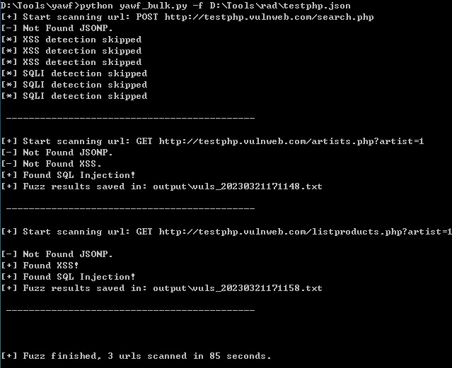

## Yawf - Yet Another Web Fuzzer

[中文](README.md)

**Yawf** is an open-source web vulnerability automated detection tool that first identifies all test points through automatic discovery or manual marking, then uses vulnerability probes to detect each test point one by one, comprehensively and efficiently discovering common web vulnerabilities, including: XSS, SQL injection, XXE, SSRF, Directory traversal, Log4Shell, RCE, and JSONP sensitive information disclosure.

⭐ Selected for KCon 2024 [Arsenal](https://kcon.knownsec.com/index.php?s=bqp&c=category&id=3)

### Features

1.  Supports detection of dynamic URLs and HTTP Request file targets;
2.  Supports manual and automatic marking of test points, covering query strings, cookies, and POST body;
3.  Supports GET and POST requests, as well as form, JSON, and XML data types;
4.  Supports HTTP Basic/Digest/NTLM authentication;
5.  Supports parallel (multi-process) detection of test targets;
6.  Easy to extend, with modular probes separated from payload files, providing a unified running interface;
7.  Supports information gathering and intelligent analysis using large language models;
8.  Supports HTTP network proxy settings;
9.  Supports two Out-of-Band detection services: ceye and dnslog;
10. Highly configurable, with simple configuration for customized requirements;
11. Supports batch URL detection with results output to a specified directory.

### Vulnerability Probes

1.  **xss** - Cross-site scripting probe
2.  **sqli** - SQL injection probe
3.  **dt** - Directory traversal probe
4.  **fastjson** - Fastjson probe (detects if the target uses the Fastjson component)
5.  **log4shell** - Log4Shell probe
6.  **xxe** - XXE probe
7.  **ssrf** - SSRF probe
8.  **jsonp** - JSONP probe
9.  **rce** - RCE probe

### Installation

Requires Python 3.8+ to run. First, download the project code, then install the dependencies.

```console
$ git clone https://github.com/phplaber/yawf.git
$ cd yawf
$ pip3 install -r requirements.txt
```

Before formal use, it is recommended to run the information gathering script to obtain target information, such as: service status, whether a WAF is deployed, Web Server, framework/scripting language, port information, SSL certificate information, and DNS records, to formulate a scanning strategy. At the same time, you can also configure the use of large language models for intelligent analysis of the collected information, providing guidance for the next step of testing.

```console
$ python3 getinfo.py -h

Usage: getinfo.py [options]

+ Get infomation of target +

Options:
  -h, --help            show this help message and exit
  -u URL, --url=URL     Target URL(e.g. "http://www.target.com")
  -t TIMEOUT, --timeout=TIMEOUT
                        Port scan timeout (s)
  --req-timeout=REQ_TIMEOUT
                        HTTP request timeout (s)
```

Since Yawf uses headless Chrome when detecting XSS vulnerabilities, a Chrome environment needs to be installed in advance.
First, install the driver [ChromeDriver](https://sites.google.com/chromium.org/driver/) and place the executable in the PATH directory; second, install the Chrome executable. When running on Windows and Mac platforms, if the Chrome application is already installed, no additional installation is needed; when running on Linux platforms, you need to install the google-chrome executable and place it in the PATH directory.
If browser-related errors are reported when executing Yawf, please focus on checking whether ChromeDriver and Chrome are correctly placed in the PATH directory. In addition, you also need to pay attention to whether the versions of ChromeDriver and Chrome match.

```console
$ cp yawf.conf.sample yawf.conf
$ python3 yawf.py -h

_____.___.  _____  __      _____________
\__  |   | /  _  \/  \    /  \_   _____/
 /   |   |/  /_\  \   \/\/   /|    __)  
 \____   /    |    \        / |     \   
 / ______\____|__  /\__/\  /  \___  /   
 \/              \/      \/       \/    

Automated Web Vulnerability Fuzzer      
v2.7                               
Created by yns0ng (@phplaber)           

Usage: yawf.py [options]

Options:
  -h, --help            show this help message and exit
  -u URL, --url=URL     Target URL (e.g.
                        "http://www.target.com/page.php?id=1")
  -m METHOD             HTTP method, default: GET (e.g. POST)
  -d DATA               Data string to be sent through POST (e.g. "id=1")
  -c COOKIES            HTTP Cookie header value (e.g. "PHPSESSID=a8d127e..")
  --headers=HEADERS     Extra headers (e.g. "Accept-Language: fr\nETag: 123")
  --auth-type=AUTH_TYPE
                        HTTP authentication type (Basic, Digest, NTLM)
  --auth-cred=AUTH_CRED
                        HTTP authentication credentials (user:pass)
  -f REQUESTFILE        Load HTTP request from a file
  --output-dir=OUTPUT_DIR
                        Custom output directory path
  --probe-list          List of available probes
  --oob-provider=OOB_PROVIDER
                        Out-of-Band service provider, default: ceye (e.g.
                        dnslog)
```

### Usage

#### Configuration

Copy the configuration sample file **yawf.conf.sample** and rename it to **yawf.conf**. Modify the configuration items in the **yawf.conf** file according to your needs, such as network proxy, scheme, and probes.

- Configure the network proxy server in the **proxy** item, such as: 127.0.0.1:8080, which is useful when debugging payloads;

- **scheme** needs to be used with the **-f** option, the default is https;

- Configure the request timeout in the **timeout** item, supporting decimals, in seconds, the default is 30 seconds;

- Configure a custom UA in the **user_agent** item; if left blank, the default UA will be used;

- Configure custom probes in the **customize** item, multiple probes need to be separated by commas, and the probe names are listed above. If the **customize** item is empty, the probes configured in the **default** item will be used. If the **default** item is also empty, the fallback is the xss probe;

- Configure the Identifier assigned by the ceye.io platform in the **id** item; configure the API Token assigned by the ceye.io platform in the **token** item. After logging into the ceye.io platform, you can see the contents of these two items on the Profile page. By default, the ceye out-of-band service is used for more stable service;

- Configure the large language model name in the **model** item, such as: deepseek-chat; configure the large language model base URL and API call credentials in the **base_url** and **api_key** items respectively. And set the **status** item to enable to use the large language model for intelligent analysis;

- Configure the operating system platform of the test target in the **platform** item, the default is Linux. When encountering platform-specific payloads, Yawf will conduct targeted tests based on this configuration, reducing ineffective network requests;

In addition, the **ignore_params.txt**, **dt_and_ssrf_detect_params.txt**, and **sens_info_keywords.txt** files in the **data** directory are pre-configured with parameters to be ignored by automatic marking, dt and ssrf probe detection parameters, and sensitive information keywords for detecting JSONP sensitive information disclosure vulnerabilities. The contents of the above three files can be modified as needed. Through this processing method, many ineffective requests can be reduced, greatly improving detection efficiency.

#### Marking

Yawf supports manual and automatic marking of test points, supporting marking at query strings, cookies, and POST body.

When you need to test a single input point, just manually mark **[fuzz]** after the parameter value, and Yawf will only detect that position. Note that manual marking needs to retain the original parameter value. When actually performing PoC testing, Yawf will flexibly choose whether to retain the original parameter value according to the probe type.

```
http://test.sqlilab.local/Less-1/?id=3[fuzz]
```

You can also manually mark input points in the HTTP Request file, the content of which can be obtained through Live HTTP Headers or Burp Suite.

```
GET /Less-1/?id=3[fuzz] HTTP/1.1
Host: test.sqlilab.local
User-Agent: Yawf v2.0
Accept: text/html,application/xhtml+xml,application/xml;q=0.9,*/*;q=0.8
Accept-Language: zh-CN,zh;q=0.8,zh-TW;q=0.7,zh-HK;q=0.5,en-US;q=0.3,en;q=0.2
Accept-Encoding: gzip, deflate
Connection: keep-alive
Upgrade-Insecure-Requests: 1
```
If you want to detect input points as comprehensively as possible, do not mark manually, and Yawf will intelligently automatically mark all places that meet the conditions.

Supported marking positions are as follows:

1.  **Query String**
    -  `?par1=val1&par2=val2[fuzz]`, regular query string data format
    -  `?par1={"foo":"bar[fuzz]"}`, parameter value is JSON encoded data format, supporting marking of string values in JSON
    -  `?par1={"foo":"bar[fuzz]"}&par2=val2[fuzz]`, combined form
2.  **Cookie**
    -  `k1=v1[fuzz]; k2=v2[fuzz]`, regular key-value pair data format
3.  **POST Body**
    -  `par1=val1&par2=val2[fuzz]`, regular form encoded data format
    -  `{"par1":"val1","par2":"val2[fuzz]"}`, JSON encoded data format, supporting marking of string values in JSON
    -  `<par1>val1[fuzz]</par1>`, XML encoded data format

It should also be noted that in automatic marking mode, whether a parameter is marked is also affected by **ignore_params.txt**.

#### Running the Script

Set the necessary parameters, run the **yawf.py** script, and wait for the script to finish running. Once Yawf discovers a suspected vulnerability, if the **--output-dir** option passes in a directory path, the vulnerability details will be written to a file named by timestamp in that directory; otherwise, it will be written to a file in the output directory at the same level as the script, also named by timestamp. If the directory does not exist, Yawf will safely create it.

Vulnerability details include the marked request object, payload, the request object that triggered the vulnerability, and the vulnerability type.

```json
{
  "request": {
    "url": "http://testphp.vulnweb.com/listproducts.php",
    "method": "GET",
    "params": {
      "cat": "[fuzz]"
    },
    "proxies": {
      
    },
    "cookies": {
      
    },
    "headers": {
      "user-agent": "Mozilla/5.0 (Windows NT 10.0; Win64; x64) AppleWebKit/537.36 (KHTML, like Gecko) Chrome/109.0.0.0 Safari/537.36",
      "accept-encoding": "gzip, deflate",
      "accept": "*/*",
      "connection": "keep-alive"
    },
    "data": {
      
    },
    "auth": {
      
    },
    "timeout": 30.0,
    "fastjson_detect_flag": false,
    "dt_and_ssrf_detect_flag": false
  },
  "payload": "<script>alert(1)</script>",
  "poc": {
    "url": "http://testphp.vulnweb.com/listproducts.php",
    "method": "GET",
    "params": {
      "cat": "<script>alert(1)</script>"
    },
    "proxies": {
      
    },
    "cookies": {
      
    },
    "headers": {
      "user-agent": "Mozilla/5.0 (Windows NT 10.0; Win64; x64) AppleWebKit/537.36 (KHTML, like Gecko) Chrome/109.0.0.0 Safari/537.36",
      "accept-encoding": "gzip, deflate",
      "accept": "*/*",
      "connection": "keep-alive"
    },
    "data": {
      
    },
    "auth": {
      
    },
    "timeout": 30.0,
    "fastjson_detect_flag": false,
    "dt_and_ssrf_detect_flag": false
  },
  "type": "XSS"
}
```

#### Running Batch Detection Script

After using a browser crawler tool (such as [flamingo](https://github.com/phplaber/flamingo), etc.) to crawl a batch of complete request objects and generate a specific JSON file, run the **yawf_bulk.py** script for batch detection. The JSON file format is as follows:

```json
[
   {
      "method":"POST",
      "url":"http://testphp.vulnweb.com/search.php",
      "headers":{
         "Accept":"text/html,application/xhtml+xml,application/xml;q=0.9,image/avif,image/webp,image/apng,*/*;q=0.8,application/signed-exchange;v=b3;q=0.9",
         "Content-Type":"application/x-www-form-urlencoded",
         "Cookie":"login=test%2Ftest",
         "Origin":"http://testphp.vulnweb.com",
         "Referer":"http://testphp.vulnweb.com/",
         "Upgrade-Insecure-Requests":"1",
         "User-Agent":"Rad v0.4 crawler"
      },
      "data":"Z29CdXR0b249Z28mc2VhcmNoRm9yPTE="
   },
   {
      "method":"GET",
      "url":"http://testphp.vulnweb.com/artists.php?artist=1",
      "headers":{
         "Accept":"text/html,application/xhtml+xml,application/xml;q=0.9,image/avif,image/webp,image/apng,*/*;q=0.8,application/signed-exchange;v=b3;q=0.9",
         "Upgrade-Insecure-Requests":"1",
         "User-Agent":"Mozilla/5.0 (Windows NT 6.1; Win64; x64) AppleWebKit/537.36 (KHTML, like Gecko) Chrome/109.0.0.0 Safari/537.36"
      },
      "data":""
   },
   {
      "method":"GET",
      "url":"http://testphp.vulnweb.com/listproducts.php?artist=1",
      "headers":{
         "Accept":"text/html,application/xhtml+xml,application/xml;q=0.9,image/avif,image/webp,image/apng,*/*;q=0.8,application/signed-exchange;v=b3;q=0.9",
         "Upgrade-Insecure-Requests":"1",
         "User-Agent":"Mozilla/5.0 (Windows NT 6.1; Win64; x64) AppleWebKit/537.36 (KHTML, like Gecko) Chrome/109.0.0.0 Safari/537.36"
      },
      "data":""
   }
]
```

Use the -f option to pass in the JSON file path, and you can batch detect vulnerabilities. Batch detection does not support manual marking.



#### Adding New Probes

Because Yawf's probes are modular and separated from payload files, adding new probes is very easy.

1. If the probe needs to use payloads to detect vulnerabilities, add a file with the same name in the **payload** directory, such as: **demo.txt**, with one payload per line in the file;
2. Add a probe file with the same name in the **probes** directory, such as: **demo.py**, and implement the **run** function, with the function parameter being a **Probe** class instance;
3. When you need to use the new probe, configure the new probe in the **customize** item in the configuration file, such as: **demo**.

The following is a brief description of adding a new probe, for details, refer to the probes in the **probes** directory:

```python
# demo.py
from utils.utils import send_request
from core.probe import Probe

def run(probe_ins: Probe) -> None:
    # Implement skip detection logic
    if need_skip_detect:
      print("[*] DEMO detection skipped")
      return

    # Use payloads one by one for detection
    for payload in probe_ins.probes_payload['demo']:
      # Generate payload request object
      payload_request = probe_ins.gen_payload_request(payload)

      # Send request
      response = send_request(payload_request)

      # Analyze results
      # With echo, analyze response content to determine if vulnerability exists
      # Without echo, use out-of-band detection to determine if vulnerability exists

      # If a vulnerability is detected, write the vulnerability information to the result queue and exit the loop
      if vulnerable:
        probe_ins.fuzz_results.put({
          'request': probe_ins.request,
          'payload': payload,
          'poc': payload_request,
          'type': 'DEMO'
        })
        break
```

### Docker Installation and Running

In addition to the above installation and running methods, Docker installation and running of Yawf is also supported. Using Docker is more convenient and can quickly set up the environment for running Yawf, including: ChromeDriver, google-chrome, Python3, and dependent modules.

```console
$ git clone https://github.com/phplaber/yawf.git
$ cd yawf
$ cp yawf.conf.sample yawf.conf
$ docker build --no-cache -t yawf_env .
$ docker run -it --rm --ulimit nofile=256:256 -v ~/Sec/scan/:/data --user $(id -u):$(id -g) yawf_env yawf.py -u "http://testphp.vulnweb.com/listproducts.php?cat=1" --output-dir=/data
```

At this point, the use of Yawf is complete. The next step is human intervention to confirm whether vulnerabilities exist, their severity, and then enter the vulnerability handling process.

### Disclaimer

This tool is only for enterprise security personnel to assess the security risks of their own enterprise assets, or for legally authorized security testing. Please do not use it for other purposes; if you do, you will be responsible for the consequences.